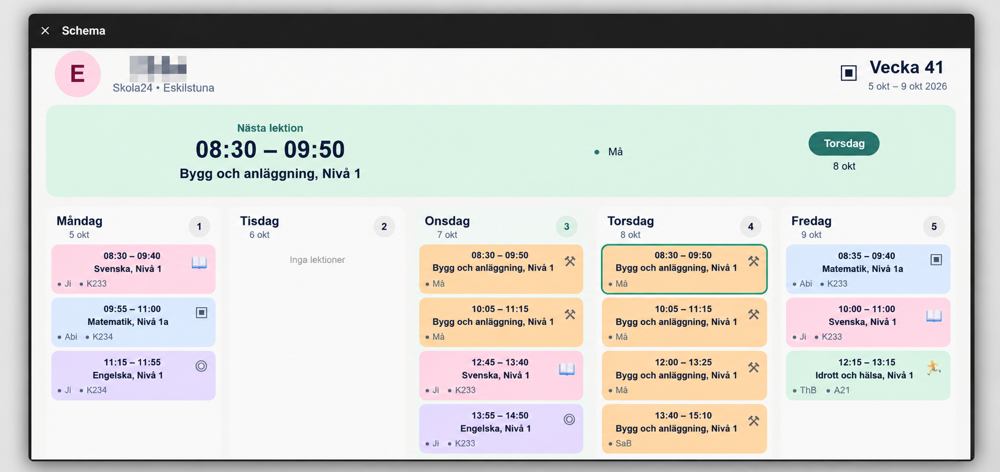

# Skola24 Schema – Home Assistant

A custom Home Assistant integration for retrieving personal schedules from Skola24.

## Features

- Select the Skola24 login domain during setup.
- Log in with a Skola24 username and password.
- Automatically discover students available under **Mina barn** when supported.
- Use a student's **SchemaID** as the stable identifier for the personal schedule.
- Regenerate the Skola24 signature from SchemaID when fetching a schedule, avoiding stale cached selections.
- Show the current and upcoming school weeks in Home Assistant.
- Configure the weekday/time used for the automatic week change.
- Configure how many future weeks are retained.
- Configure the schedule update interval.
- Provide buttons for manual schedule refresh and week navigation.

## Installation

### Manual

Copy the `custom_components/skola24` directory into your Home Assistant `config/custom_components/` directory.

The resulting structure should be:

```text
config/
└── custom_components/
    └── skola24/
        ├── brand
            └── icon.png
        ├── __init__.py
        ├── api.py
        ├── button.py
        ├── config_flow.py
        ├── const.py
        ├── coordinator.py
        ├── domains.py
        ├── en.json
        ├── manifest.json
        ├── sensor.py
        └── sv.json
```

Restart Home Assistant and add **Skola24 Schema** from **Settings → Devices & services → Add integration**.

## Configuration

During setup you select:

- Skola24 domain
- Student name
- Entity ID
- Username
- Password
- Optional SchemaID

The integration includes the available Skola24 domains from the supplied Skola24 login-domain list.

After login, the integration can discover students and their SchemaIDs. The SchemaID is then used to generate the signature required to retrieve the personal timetable.

### SchemaID

A SchemaID can be found in Skola24 under:

**Mina inställningar → Mina uppgifter → Mina barn**

If automatic discovery does not work, the SchemaID can be entered manually.

## Options

The integration options allow you to configure:

- Skola24 domain
- Student
- Entity ID
- Day and time for automatic week changes
- Number of future weeks
- Update interval

## Entity examples

A configured student may create entities such as:

```text
sensor.skola24_elev
button.skola24_elev_hamta_schema_nu
button.skola24_elev_forra_veckan
button.skola24_elev_nasta_veckan
```

The exact entity IDs depend on the Entity ID selected during configuration.

## Security

Credentials are stored in the Home Assistant config entry. Do not commit your Home Assistant configuration, credentials, or personal SchemaIDs to a public repository.

The integration itself does not contain user credentials or personal student SchemaIDs.

## Version 0.6.4

- Prepared the integration for public repository use.
- Corrected the manifest version to `0.6.4`.
- Removed an unnecessary hardcoded Eskilstuna host constant.
- Removed the Eskilstuna-specific fallback used when generating the config-entry unique ID.
- Updated documentation from the development-oriented 0.6.x README to generic Skola24 documentation.


## HACS

This repository is prepared for installation through HACS as a custom integration repository.

1. Open HACS in Home Assistant.
2. Open the Integrations section.
3. Use the three-dot menu and choose **Custom repositories**.
4. Add `Kretiandpleti/skola-24-haos-integration`.
5. Select **Integration** and install **Skola24 Schema**.
6. Restart Home Assistant.

## Example

Example of how a Skola24 schedule can be displayed in Home Assistant:


